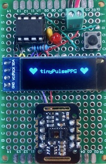
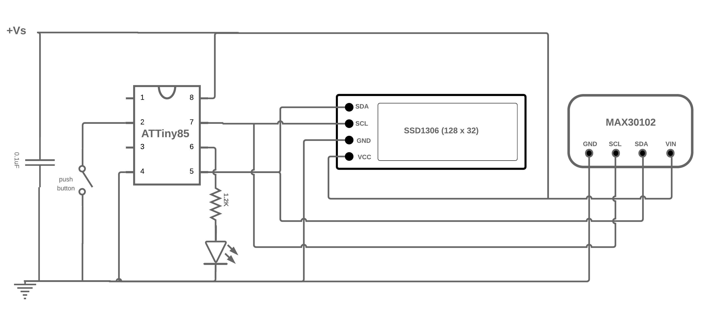
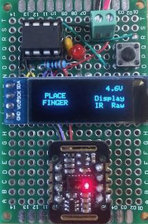
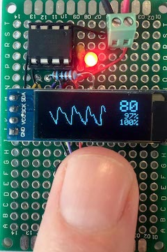
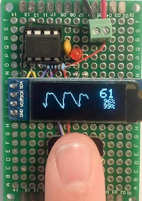

# tinyPulsePPG

This project implemented on an ATTiny85 displays a moving Photoplethysmogram together with pulse rate and estimates of SpO2 - blood oxygen percentage. It uses an SSD1306 128x32 OLED display and a Max30102 sensor. It is emphasised that this should **not be used for medical purposes**. The computation of SpO2 is very approximate and not calibrated in any way. The project is an exercise in software and hardware parsimony.

### Hardware
The system was implemented on a prototyping board as shown below:

The circuit diagram is:

The ATTiny85 is configured to run at 16 MHz using Spence Konde's ATTinyCore. Consequently, according to the datasheet, the supply voltage should be >4.5V. In fact, it seems to run quite happily from a lipo battery (3.7 - 4.2V).

### Operation

After a few seconds the following screen is displayed:

When a finger is placed on the sensor, the PPG, heart-rate and two estimates of blood oxygen are displayed (discussed below)  are displayed:

 ..........  

The red led pulses once per heart beat. The PPG display is updated every 50ms.

### Software

**Driver issue -** The Maxim max30102 sensor used is mounted on a MH-ET LIVE breakout board. The Maxim datasheet for the max30102 implies but does not state explicitly that LED1 is Red and LED2 is Infrared (IR), however, if the amplitude of LED1 is set to zero, the red led (as depicted in the *place finger*) picture remains lit, while if LED2 is set to zero, the red led is extinguished. The obvious conclusion is that LED1 is IR and LED2 is Red (i.e. swapped) which also works when computing blood oxygen - see below. I mention this as the most common driver used in Arduino projects for the max30102 is the Sparkfun 3010x driver which clearly identifies LED1 with Red and LED2 with IR. This may be true for the max30105 device mounted on the Sparkfun board but does not seem to apply to the max30102 on the MH-ET-LIVE board. 

**Spo2 calculation** *"SpO2 stands for peripheral capillary oxygen saturation, an estimate of the amount of oxygen in the blood. More specifically, it is the percentage of oxygenated haemoglobin (haemoglobin containing oxygen) compared to the total amount of haemoglobin in the blood (oxygenated and non-oxygenated haemoglobin). - Merriam Webster Dictionary"* 

Oxygenated haemoglobin and deoxygenated haemoglobin have different light absorption characteristics for red and IR wavelengths. This is the basis for sensors like the max30102. The calculation uses the ratio:

`R = (AC_red/DC_red)/(AC_IR/DC_IR)`

where `AC_xxx `is the fluctuating component of the xxx signal and `DC_xxx` is the fixed component. **tinyPulsePPG** uses R in two different formulas. The upper percentage is from the classic formula:

`R = 104 - 1.7 * R`

The lower uses a table from the Maxim Arduino driver which is an approximation of the formula:

`-45.060 * R * R + 30.354 * R + 94.845`

The AC is computed in **tinyPulsePPG** as the peak to peak amplitude of the signal after the DC element has been removed.  the DC element is computed by an exponential moving average filter and the AC is also filtered. I have not experimented enough with the constants in these filters to determine the effect on the SpO2 calculation or indeed how reliable this method is of computing these quantities.

**PPG display** The read and IR signals from the sensor go through two stages of filtering. The first as described above is removal of the DC element. The second is a moving average filter which acts as a low pass filter to remove transients before the signal is input to the beat detector. I have chosen to display the signal after the first filtering phase so that it retains more interesting features. For example, dicrotic notches can be seen in the pictures above - *"a secondary upstroke in the descending part of a pulse tracing corresponding to the transient increase in aortic pressure upon closure of the aortic valve."*
I have noticed that if this dicrotic notch is particularly strong - younger individuals - it can overcome the second stage filtering and cause erroneous output from the beat detector which essentially looks for peaks and valleys in the wave. On going work!

